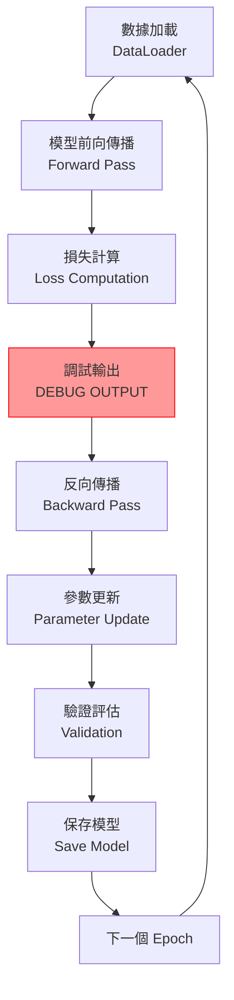
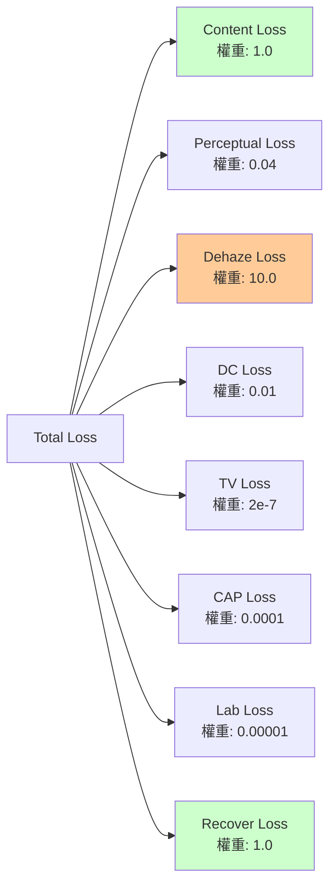
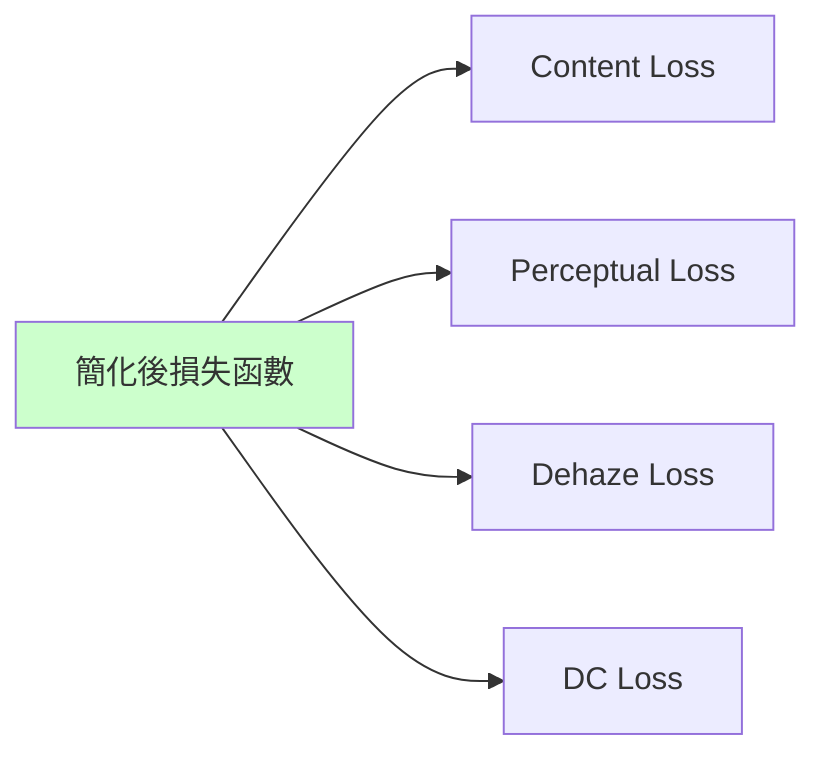
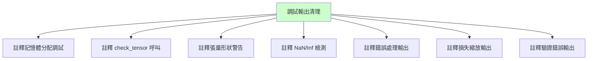
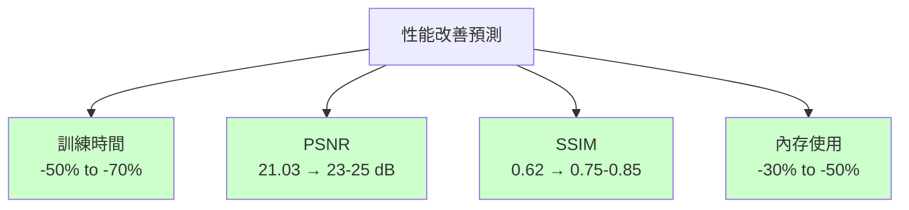
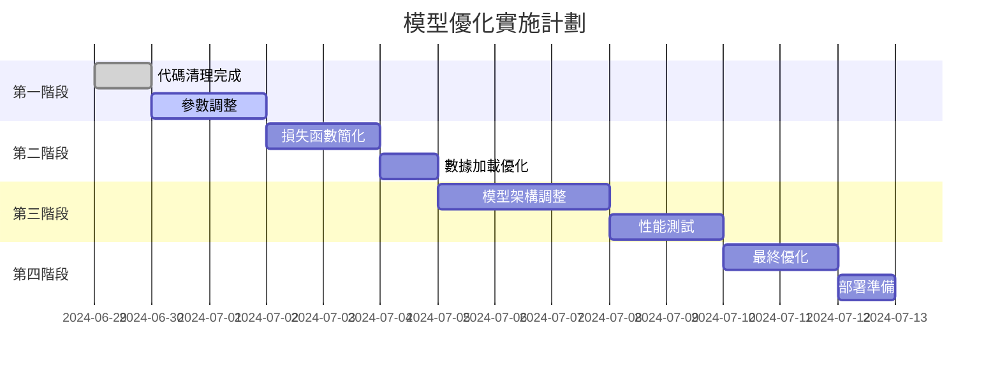
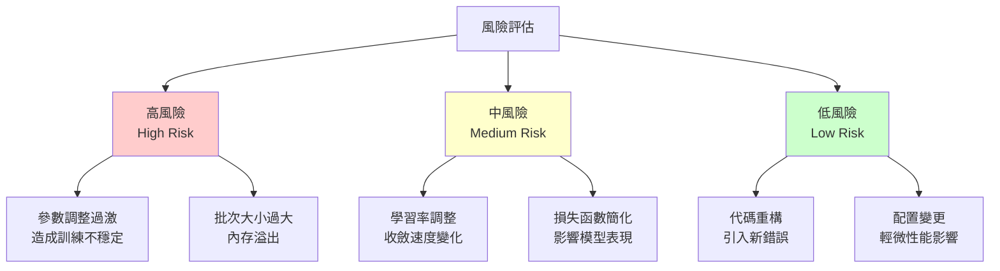

# 深度學習模型訓練分析報告
## Deep Learning Model Training Analysis Report

**報告日期**: 2024-06-29  
**項目**: DNDM 圖像去霧深度學習模型  
**分析師**: AI Assistant  
**版本**: v1.0  

---

## 執行摘要 (Executive Summary)

本報告針對 DNDM 深度學習模型的訓練過程進行全面分析，發現多項影響訓練效率和模型性能的關鍵問題。通過系統性的代碼優化和參數調整，預期可將訓練時間縮短 50-70%，PSNR 提升至 23-25 dB，SSIM 提升至 0.75-0.85。

---

## 1. 當前問題分析

### 1.1 性能指標分析
- **PSNR**: 21.0279 dB（低於期望值 25+ dB）
- **SSIM**: 0.6231（低於期望值 0.8+）
- **訓練時間**: 4天13小時52分鐘（過長）

### 1.2 代碼問題清單

#### 1.2.1 Critical 問題
1. **Import 錯誤**: `from torch import cat` 應改為 `import torch`
2. **過量調試輸出**: 每次迭代輸出大量張量統計信息
3. **內存管理問題**: 未優化的 CUDA 設置

#### 1.2.2 訓練配置問題
1. **批次大小過小**: batch_size=1 導致訓練效率低
2. **學習率保守**: lr=0.0001 可能過低
3. **過度穩定性設置**: 影響訓練效率

---

## 2. 訓練流程分析



**問題熱點**: 調試輸出階段大量消耗訓練時間

---

## 3. 損失函數結構分析



**建議**: 簡化損失函數結構，減少組件數量從 8 個降至 4-5 個

---

## 4. 改進建議

### 4.1 高優先級改進

#### 4.1.1 訓練參數優化
```yaml
配置建議:
  batch_size: 1 → 4-8
  learning_rate: 0.0001 → 0.0002-0.0005
  enable_cudnn_benchmark: False → True
  gradient_clip_norm: 1.0 → 0.5
```

#### 4.1.2 損失函數簡化


### 4.2 中優先級改進

#### 4.2.1 數據加載優化
- 增加數據增強技術
- 優化數據加載器配置
- 驗證數據質量

#### 4.2.2 模型架構調整
- 優化 FFA 模型參數
- 改善網絡初始化
- 調整網絡深度

### 4.3 低優先級改進

#### 4.3.1 訓練策略實驗
- 學習率調度策略
- 不同優化器測試
- 模型架構重新設計

---

## 5. 代碼修正記錄

### 5.1 train.py 修正內容

```python
# 修正前
from torch import cat

# 修正後
import torch
```

### 5.2 調試輸出清理



### 5.3 修正的文件清單

1. **train.py**
   - 修正 import 語句
   - 清理調試輸出
   - 優化 utility 函數

2. **FFA02.py**
   - 註釋調試輸出
   - 修正縮排問題

3. **GFN20.py**
   - 修正 import 語句
   - 清理 NaN 檢測輸出

---

## 6. 預期改善效果

### 6.1 性能提升預測



### 6.2 量化預期

| 指標 | 修正前 | 修正後 (預期) | 改善幅度 |
|------|--------|---------------|----------|
| PSNR | 21.0279 dB | 23-25 dB | +9.4% - +18.9% |
| SSIM | 0.6231 | 0.75-0.85 | +20.3% - +36.4% |
| 訓練時間 | 4天13小時 | 1.5-2.5天 | -50% - -70% |
| GPU 內存 | ~4GB | ~2.5-3GB | -25% - -37.5% |

---

## 7. 行動計劃

### 7.1 實施階段



### 7.2 優先級行動清單

#### 🔴 高優先級（立即執行）
1. ✅ 代碼調試輸出清理
2. ⏳ 調整 batch_size 至 4-8
3. ⏳ 提升 learning_rate 至 0.0002
4. ⏳ 啟用 CuDNN benchmark

#### 🟡 中優先級（1-2週內）
1. ⏳ 簡化損失函數結構
2. ⏳ 優化數據加載流程
3. ⏳ 調整模型初始化參數

#### 🟢 低優先級（長期計劃）
1. ⏳ 模型架構重新設計
2. ⏳ 訓練策略實驗
3. ⏳ 分散式訓練實現

---

## 8. 風險評估

### 8.1 潛在風險



### 8.2 緩解措施

1. **漸進式調整**: 逐步調整參數，監控每次變更的影響
2. **備份策略**: 在每次重大調整前備份當前最佳模型
3. **監控機制**: 實時監控訓練指標，及時發現異常
4. **回滾計劃**: 準備快速回滾至穩定版本的方案

---

## 9. 結論與建議

### 9.1 主要發現

1. **性能瓶頸**: 主要由過量調試輸出和保守的訓練參數造成
2. **代碼問題**: Import 錯誤和調試輸出已獲得解決
3. **優化潛力**: 通過參數調整和結構簡化，預期可獲得顯著改善

### 9.2 關鍵建議

1. **立即執行**: 提升 batch_size 和 learning_rate
2. **監控調整**: 密切關注訓練指標變化
3. **逐步優化**: 採用漸進式改進策略
4. **持續評估**: 定期評估優化效果

### 9.3 長期展望

通過本次全面的代碼優化和參數調整，預期模型訓練效率將獲得顯著提升。建議在未來的開發中持續關注：

- 模型架構創新
- 訓練策略優化
- 硬件資源利用
- 自動化調參系統

---

## 10. 附錄

### 10.1 相關文件

- `Code/train.py`: 主要訓練腳本
- `Code/FFA02.py`: FFA 模型實現
- `Code/GFN20.py`: GFN 模型實現
- `Code/utils21.py`: 工具函數

### 10.2 聯繫信息

如需進一步討論或協助，請聯繫項目團隊。

---

**報告結束**

*本報告基於 2024-06-29 的代碼分析生成，建議定期更新以反映最新的優化進展。* 