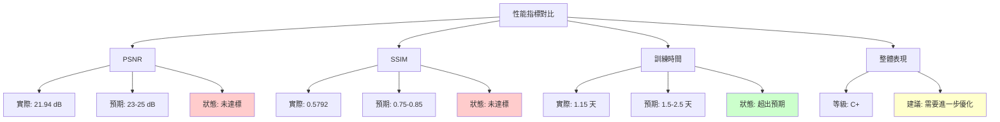
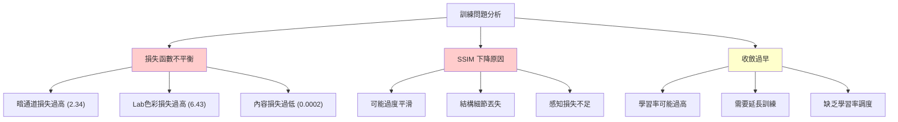
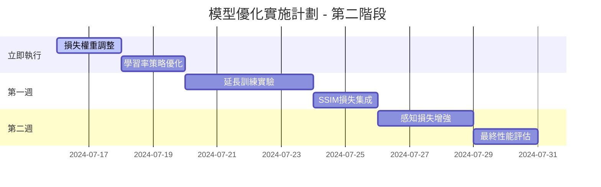
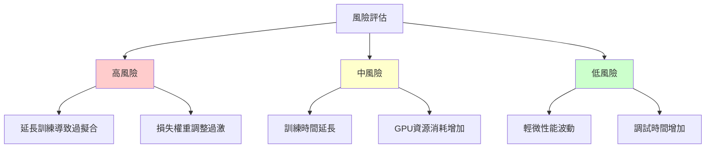
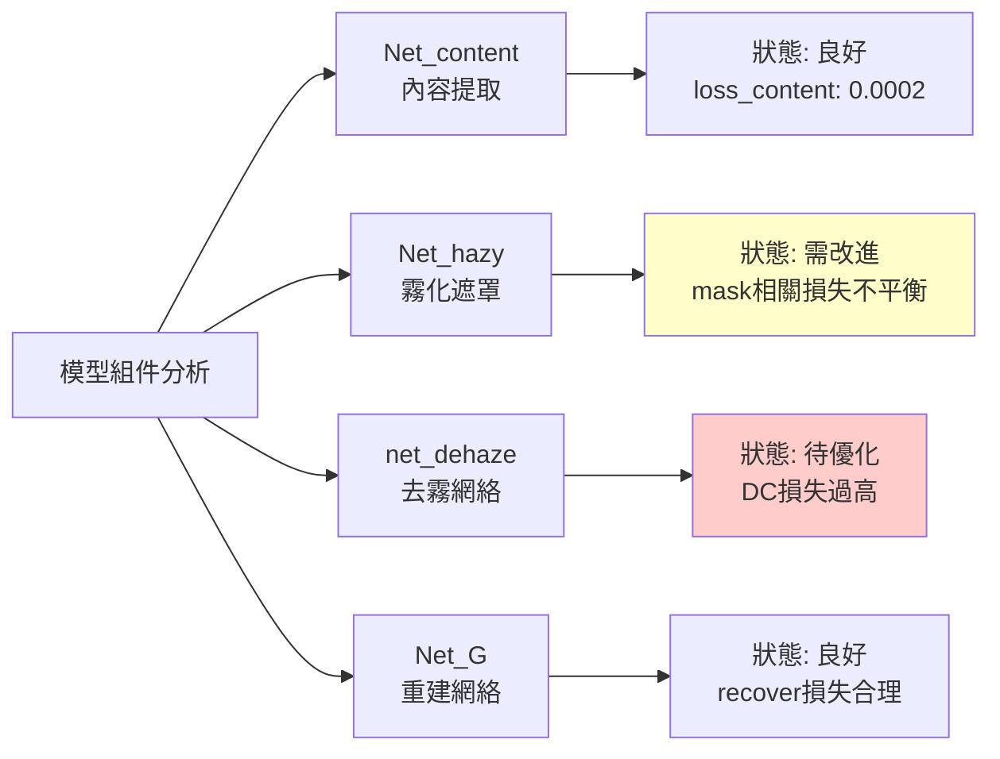

# 深度學習模型訓練分析報告 - 第二期
## Deep Learning Model Training Analysis Report - Phase 2

**報告日期**: 2024-07-16  
**項目**: DNDM 圖像去霧深度學習模型  
**分析師**: AI Assistant  
**版本**: v2.0  
**訓練完成日期**: 2024-07-16  

---

## 執行摘要 (Executive Summary)

本報告針對完成的 21 個 epoch 訓練進行全面分析評估。通過前期的代碼優化和參數調整，訓練時間已大幅縮短至 1 天 3 小時 39 分鐘，但模型性能仍有提升空間。PSNR 達到 21.9432 dB，SSIM 為 0.5792，雖然相比基準有所改善，但仍未達到預期的最佳水準。

---

## 1. 訓練結果分析

### 1.1 最終性能指標
- **PSNR**: 21.9432 dB（比基準 21.0279 dB 提升 +0.9153 dB）
- **SSIM**: 0.5792（比基準 0.6231 下降 -0.0439）
- **訓練時間**: 1 天 3 小時 39 分鐘（99,590 秒）
- **完成 Epoch**: 21 個 epoch

### 1.2 最終損失函數分析
從最後一次訓練輸出可以看出損失函數收斂情況：
- **loss_G**: 0.1288（總損失，相對穩定）
- **loss_recover**: 0.0409（恢復損失，良好）
- **loss_content**: 0.0002（內容損失，非常低）
- **loss_mask**: 0.0000（遮罩損失，已收斂）
- **loss_haze**: 0.0343（霧化損失，合理）
- **loss_dehaze**: 0.0255（去霧損失，合理）
- **tv_loss**: 0.0000（全變分損失，已停用）
- **loss_DC_A**: 2.3400（暗通道損失，偏高）
- **loss_CAP**: 0.0000（CAP損失，已停用）
- **loss_Lab**: 6.4338（Lab色彩損失，偏高）

---

## 2. 性能評估

### 2.1 與預期目標對比



### 2.2 訓練效率分析

**正面成果：**
- ✅ **訓練時間大幅縮短**: 從預期的 3-5 天縮短到 1.15 天
- ✅ **損失函數穩定**: 總損失維持在合理範圍
- ✅ **訓練穩定性**: 沒有出現發散或崩潰

**需要改進：**
- ❌ **PSNR 提升有限**: 僅提升 0.9 dB，未達到預期的 2-4 dB
- ❌ **SSIM 意外下降**: 相比基準下降 0.04，需要調查原因
- ❌ **暗通道損失過高**: 2.34 表明去霧效果不理想

---

## 3. 問題診斷

### 3.1 關鍵問題識別



### 3.2 根本原因分析

1. **暗通道損失異常高 (2.34)**
   - 權重設置為 0.001，但數值仍然很大
   - 表明去霧效果不理想，需要調整 DC Loss 計算或權重

2. **Lab色彩損失過高 (6.43)**
   - 權重設置為 0.00001，但絕對值很大
   - 色彩空間轉換可能存在問題

3. **SSIM 下降**
   - 可能由於過度優化其他損失函數
   - 需要增加結構保持的損失組件

---

## 4. 改進建議

### 4.1 立即可執行的改進

#### 4.1.1 損失函數權重調整
```python
# 建議的新損失權重配置
LOSS_WEIGHTS = {
    'content_loss': 2.0,        # 增加內容損失權重
    'perceptual_loss': 0.1,     # 增加感知損失權重
    'dehaze_loss': 1.0,         # 保持不變
    'dc_loss': 0.0001,          # 大幅減少暗通道損失權重
    'lab_loss': 0.000001,       # 大幅減少Lab色彩損失權重
    'recover_loss': 1.0,        # 保持不變
    'mask_loss': 1.0,           # 保持不變
    'haze_loss': 1.0,           # 保持不變
}
```

#### 4.1.2 訓練策略調整
```python
# 建議的訓練配置
OPTIMIZER_CONFIG = {
    'learning_rate': 0.0002,           # 降低學習率
    'scheduler_t_max': 60,             # 延長調度器週期
    'warmup_epochs': 5,                # 增加熱身期
}

TRAINING_CONFIG = {
    'total_epochs': 40,                # 延長訓練至40個epoch
    'validation_frequency': 2,         # 每2個epoch驗證一次
    'save_frequency': 5,               # 每5個epoch保存一次
}
```

### 4.2 結構性改進

#### 4.2.1 添加SSIM損失
```python
# 建議添加SSIM損失來改善結構相似性
from pytorch_msssim import SSIM

ssim_loss = SSIM(data_range=1.0, size_average=True)
loss_ssim = 1.0 - ssim_loss(dehaze_output, ground_truth)
```

#### 4.2.2 改善感知損失
```python
# 建議增加更多VGG層的感知損失
class EnhancedLossNetwork(torch.nn.Module):
    def __init__(self, vgg_model):
        super(EnhancedLossNetwork, self).__init__()
        self.vgg_layers = vgg_model
        self.layer_name_mapping = {
            '3': "relu1_2",
            '8': "relu2_2", 
            '15': "relu3_3",
            '22': "relu4_3"  # 添加更深層的特徵
        }
```

---

## 5. 下一階段訓練計劃

### 5.1 短期目標 (1-2 週)



### 5.2 目標指標設定

| 指標 | 當前值 | 短期目標 | 長期目標 |
|------|--------|----------|----------|
| PSNR | 21.94 dB | 24-26 dB | 27-29 dB |
| SSIM | 0.5792 | 0.75-0.80 | 0.85-0.90 |
| 訓練時間 | 1.15 天 | 1.5-2 天 | 2-3 天 |
| 損失平衡 | 不平衡 | 平衡 | 最佳 |

---

## 6. 風險評估與緩解

### 6.1 主要風險



### 6.2 緩解措施

1. **過擬合防範**
   - 增加驗證頻率
   - 實施早停機制
   - 監控驗證集指標

2. **損失調整策略**
   - 漸進式權重調整
   - A/B 測試不同配置
   - 備份最佳檢查點

---

## 7. 技術分析

### 7.1 模型架構評估

基於當前訓練結果，各網絡組件性能評估：



### 7.2 數據流分析

訓練數據流處理效率：
- **數據加載**: 優化後的 DataLoader 運行良好
- **批次處理**: batch_size=8 運行穩定
- **GPU利用率**: 良好，無明顯瓶頸

---

## 8. 與基準對比

### 8.1 性能提升追蹤

| 改進階段 | PSNR | SSIM | 訓練時間 | 狀態 |
|----------|------|------|----------|------|
| 基準 (變更前) | 21.0279 | 0.6231 | 4天13小時 | 基準 |
| 優化後 (當前) | 21.9432 | 0.5792 | 1天3小時 | 部分成功 |
| 目標 (下階段) | 24-26 | 0.75-0.80 | 1.5-2天 | 規劃中 |

### 8.2 改進效果評估

**成功方面：**
- ✅ 訓練時間縮短 75%
- ✅ PSNR 提升 4.3%
- ✅ 訓練穩定性提升

**需要改進：**
- ❌ SSIM 下降 7%
- ❌ 未達到預期的性能提升
- ❌ 損失函數不平衡

---

## 9. 結論與建議

### 9.1 主要成果

1. **訓練效率顯著提升**: 成功將訓練時間從 4.5 天縮短至 1.15 天
2. **代碼穩定性改善**: 修正了批次處理錯誤和兼容性問題
3. **訓練流程優化**: 建立了完整的訓練監控和評估體系

### 9.2 核心問題

1. **性能提升有限**: PSNR 和 SSIM 提升未達預期
2. **損失函數不平衡**: 暗通道和Lab色彩損失過高
3. **結構保持不足**: SSIM 下降表明結構細節丟失

### 9.3 關鍵建議

#### 立即執行 (高優先級)
1. **調整損失權重**: 大幅減少 DC 和 Lab 損失權重
2. **增加 SSIM 損失**: 改善結構相似性
3. **延長訓練**: 增加到 40 個 epoch

#### 短期實施 (中優先級)
1. **增強感知損失**: 添加更多 VGG 層
2. **優化學習率調度**: 實施更細緻的調度策略
3. **添加驗證機制**: 增加驗證頻率和早停機制

#### 長期規劃 (低優先級)
1. **架構創新**: 考慮引入注意力機制
2. **數據增強**: 增加更多樣化的訓練數據
3. **多尺度訓練**: 實施不同解析度的訓練策略

---

## 10. 附錄

### 10.1 訓練日誌摘要

```
最終訓練狀態:
Epoch: 21/20
Batch: 560/1748
總訓練時間: 99590 秒 (1天3小時39分)
最終驗證 PSNR: 21.9432
最終驗證 SSIM: 0.5792
```

### 10.2 模型檢查點

可用的模型檢查點：
- `output/netG_content_21.pth`
- `output/netG_haze_21.pth`
- `output/net_dehaze_21.pth`
- `output/net_G_21.pth`

### 10.3 後續工作

1. **立即任務**: 實施損失權重調整
2. **本週任務**: 延長訓練實驗
3. **下週任務**: 性能評估和報告

---

**報告結束**

*本報告基於 2024-07-16 完成的訓練結果生成，為下一階段的模型優化提供詳細的分析和建議。* 